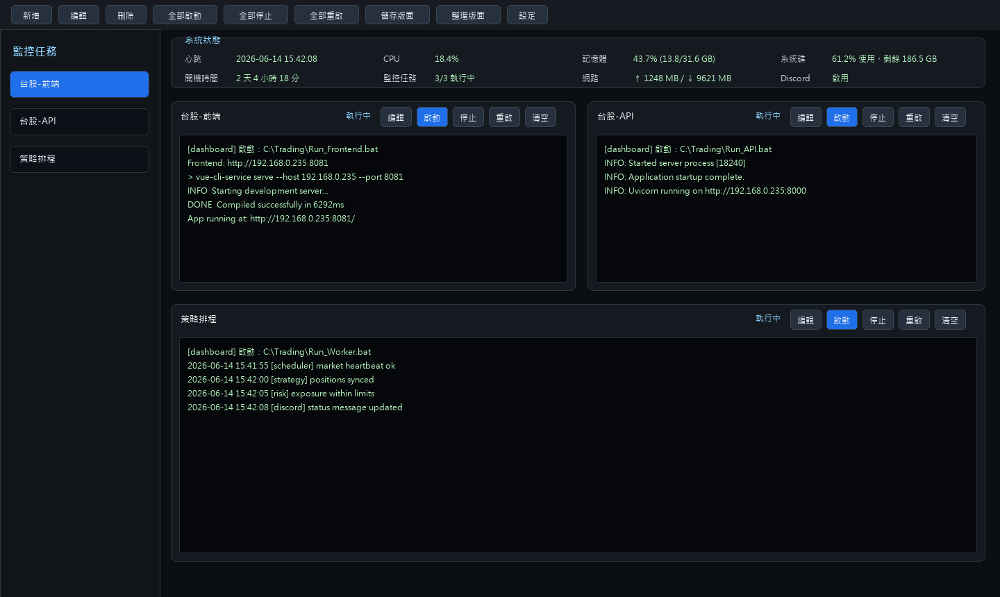
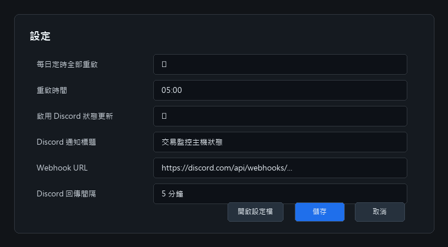
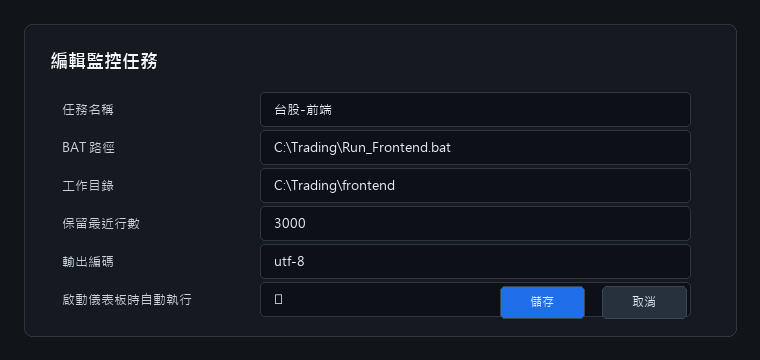
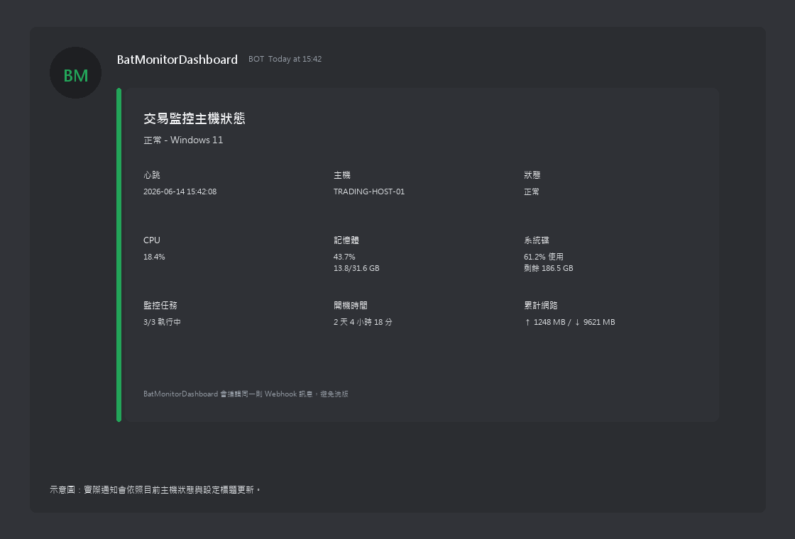

# BAT Monitor Dashboard

[繁體中文 README](README_ZH.md)



**BAT Monitor Dashboard** is a Windows desktop dashboard for supervising multiple `.bat` jobs in one place. It captures live terminal output, keeps each task in a movable panel, monitors host health, and can update a single Discord Webhook status message without spamming the channel.

## Highlights

- Multi-BAT supervision: add, edit, delete, start, stop, and restart tasks.
- Panel workspace: each task runs in a movable and resizable output panel.
- Cleaner terminal output: filters ANSI control sequences and handles Vue / Node / `npm run serve` progress updates.
- Configurable output encoding: `utf-8`, `cp950`, `big5`, or system default.
- Host metrics: heartbeat, CPU, memory, system disk, uptime, task count, and network traffic.
- Discord updates: configurable Webhook, status title, update interval, and single-message editing.
- Scheduled maintenance: restart all monitored tasks at a fixed daily time.
- Process-tree shutdown: uses `taskkill /T /F` to stop child processes reliably.

## Screenshots

| Settings | Task Editor |
| --- | --- |
|  |  |

## Discord Preview



## Install and Run

```powershell
python -m venv .venv
.\.venv\Scripts\Activate.ps1
pip install -r requirements.txt
python main.py
```

## Build EXE

```powershell
pyinstaller BatMonitorDashboard.spec
```

Build output:

```text
dist\BatMonitorDashboard.exe
```

## Configuration File

The application stores user settings at:

```text
%LOCALAPPDATA%\BatMonitorDashboard\config.json
```

You can also open the folder from the app settings dialog.

## Project Structure

```text
BatMonitorDashboardProject/
  main.py
  BatMonitorDashboard.spec
  requirements.txt
  assets/
  docs/images/
  tools/generate_readme_images.py
  src/bat_monitor_dashboard/
    app.py
    constants.py
    models.py
    dialogs.py
    panel.py
    dashboard.py
```
